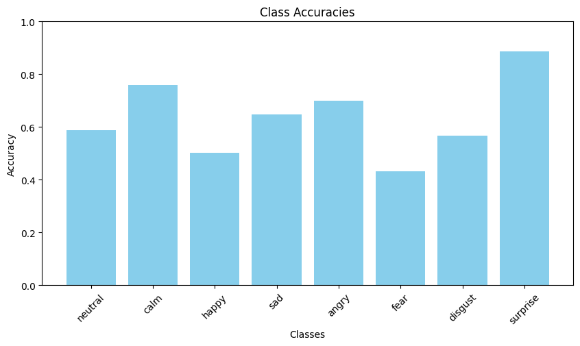

# Sonic Mood
This is a repository containing utilities and models for audio emotion classification using deep learning. Four datasets are used: CREMA, RAVDESS, SAVEE, and TESS. Training is done using all four datasets combined.

Custom Pytorch dataset classes, such as `MelspecEmotionDataset`, were developed for the purpose of training using Pytorch's dataloaders.

## Dataset Usage
```
from src.utils.dataset import MelspecEmotionDataset
import src.utils.data_processing as data_processing

# Set base directory to repository path
BASE_DIR = YOUR_PATH_TO_REPO

# import csvs used for training, validation, and testing
val_df = data_processing.read_csv(
    pd.read_csv(
        os.path.join(BASE_DIR, 'data/metadata/val_melspec.csv'),
        index_col=False
    ),
    BASE_DIR
)
val_df = data_processing.read_csv(
    pd.read_csv(
        os.path.join(BASE_DIR, 'data/metadata/val_melspec.csv'),
        index_col=False
    ),
    BASE_DIR
)
test_df = data_processing.read_csv(
    pd.read_csv(
        os.path.join(BASE_DIR, 'data/metadata/test_melspec.csv'),
        index_col=False
    ),
    BASE_DIR
)

# Create datasets.
val_ds = MelspecEmotionDataset(val_df)
val_ds = MelspecEmotionDataset(val_df)
test_ds = MelspecEmotionDataset(test_df)


# Create dataloaders
batch_size = 20
num_workers = 8
pin_memory = True if torch.cuda.is_available() else False
val_loader = torch.utils.data.DataLoader(val_ds, batch_size=batch_size, shuffle=True, num_workers=num_workers, pin_memory=pin_memory)
val_loader = torch.utils.data.DataLoader(val_ds, batch_size=batch_size, shuffle=False, num_workers=num_workers, pin_memory=pin_memory)
test_loader = torch.utils.data.DataLoader(test_ds, batch_size=batch_size, shuffle=False, num_workers=num_workers, pin_memory=pin_memory)

```

## Training Usage
```
import src.utils.train as train

net = YOUR_MODEL()
print(f'input size to fc layer: {net.conv_output_size}')
output_path = os.path.join(BASE_DIR, 'data/train/attempt14')
if os.path.exists(output_path):
    shutil.rmtree(output_path)
learning_rate = 0.0001
num_epochs = 60
device = torch.device('cuda' if torch.cuda.is_available() else 'cpu')
print(device)
train.train_net(
    net=net,
    output_path=output_path,
    train_loader=train_loader,
    val_loader=val_loader,
    batch_size=batch_size,
    learning_rate=learning_rate,
    num_epochs=num_epochs,
    device=device
)
```

## Data distribution


## Architecture


## Results



## Demo
A simple Tkinter program is developed to show the capabilities of the model. This application allows users to load an audio file from the file system, process it using our audio processing
technique, and predict the output emotion with a simple click. The application is located under `src/demo.py`


